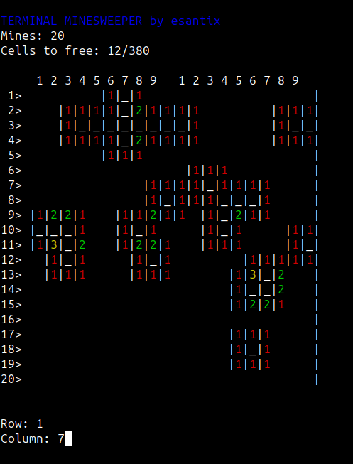

# terminal-minesweeper
Minesweeper for linux terminal




Probably the worst C written code for a minesweeper. But it is one of my first "complex" codes I ever did.

## Usage

Compile and run with
```bash
./scripts/compile.sh --run
```

Input row and column to try cell.